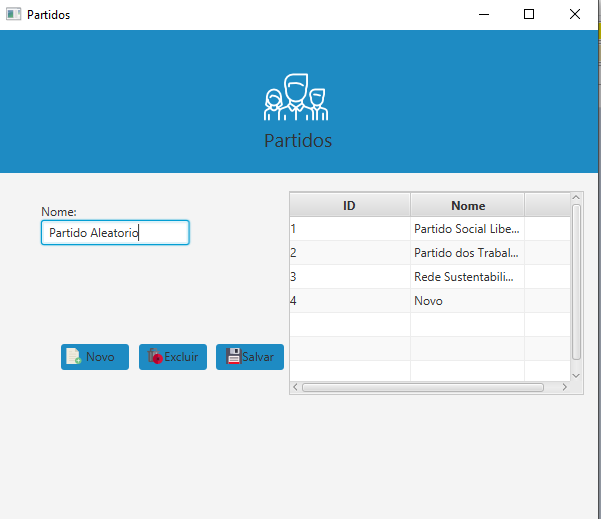

# eletronic-ballot-box
A short project to training my skills with Java

Elletronic Ballot box

**Why?**

This project is part of my studies and maybe in the future it can be part of my own portfolio. I'll be happy if you can provide any feedback about the project, code, structure or anything that you can report that could make me a better developer!

Email-me: maxsuelgomes11@gmail.com
          maxgps5@hotmail.com

Also, you can use this project as you wish.

**Some observations**

1 - The project isn't finallized yet it stills happening and i'm still working on it.

2 - I do not think in a solution to my identifeirs(ID's) so i'm using integer numbers(1,2,3) on constructors, so if you have any idea to change this, let me know.

3 - The Data base that i'm using it's mysql then i guess you will have to change the local host path in the ConnectionFactory class.

          
